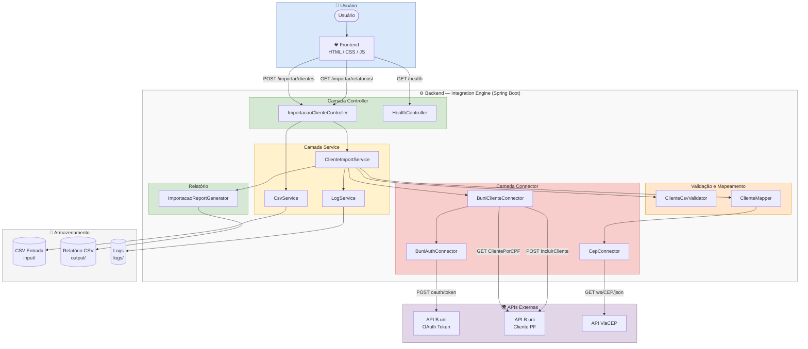
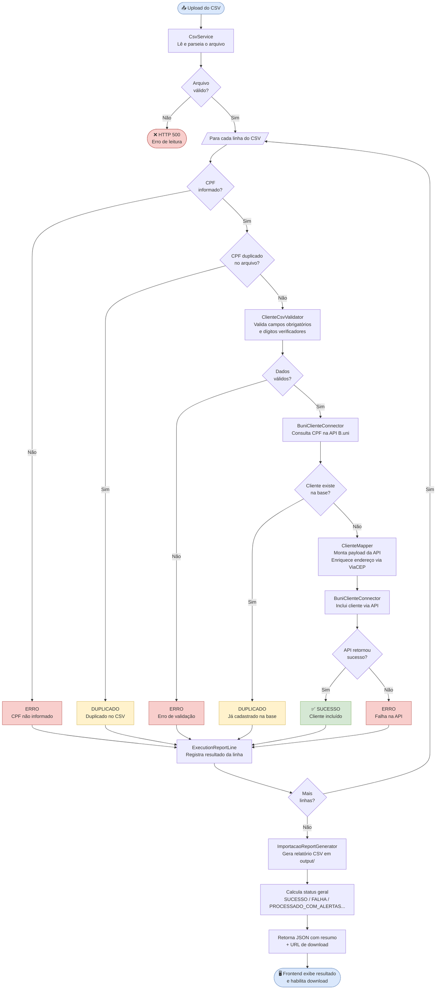
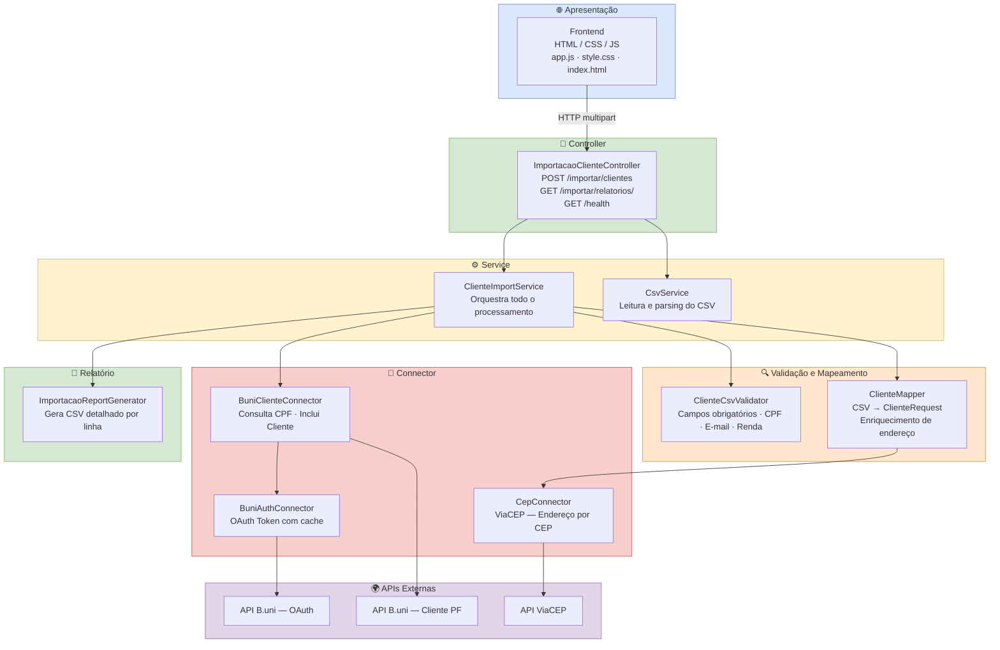
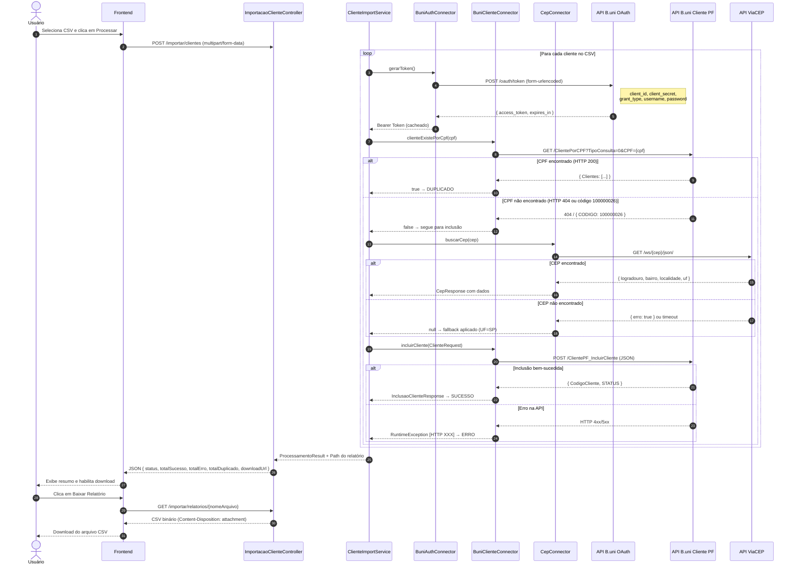
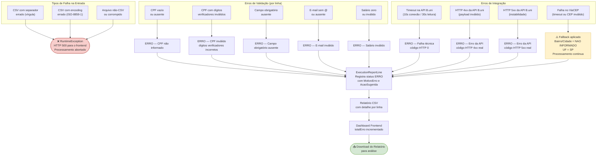
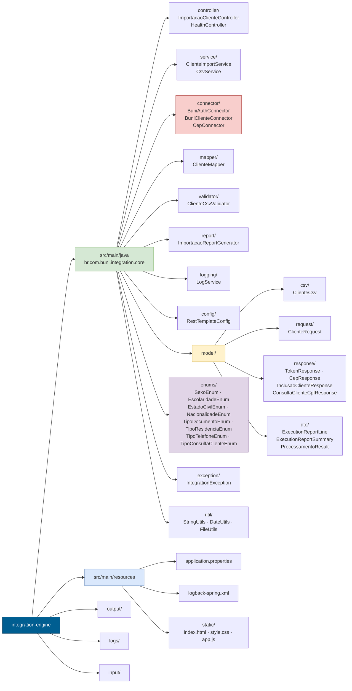
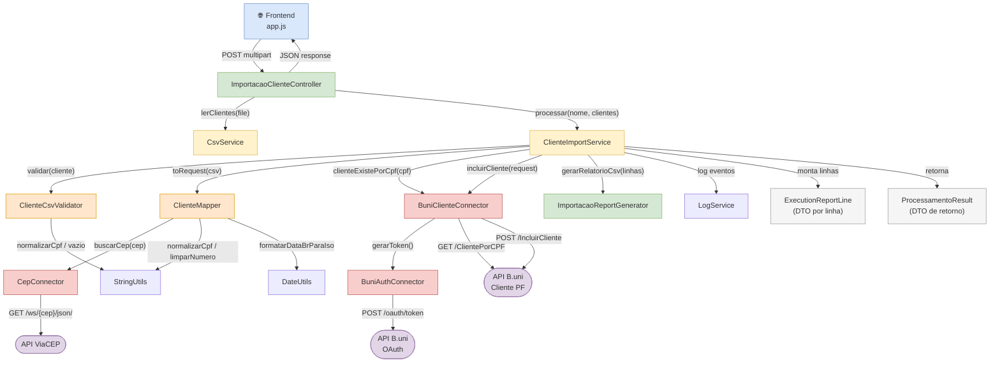
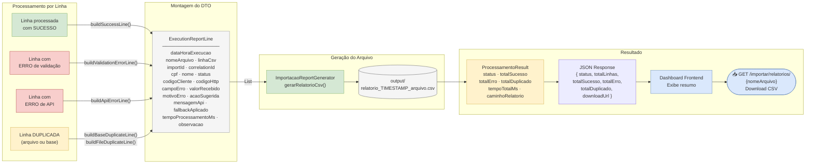

# Diagramas de Arquitetura — Portal de Importação B.uni

> Todos os diagramas são gerados com [Mermaid](https://mermaid.js.org/) e renderizam diretamente no GitHub.  
> Para edição visual, utilize o arquivo `arquitetura.drawio` na mesma pasta.

---

## 1. Arquitetura Geral

Visão completa de todos os componentes do sistema e suas integrações.

---

## 2. Fluxo da Importação

Passo a passo do processamento de cada linha do CSV.

---

## 3. Arquitetura em Camadas

Organização vertical das responsabilidades do sistema.

---

## 4. Fluxo de Integração REST

Todas as chamadas HTTP realizadas entre os componentes e as APIs externas.

---

## 5. Fluxo de Tratamento de Erros

Como o sistema lida com cada tipo de falha.

---

## 6. Estrutura do Projeto

Organização dos pacotes e suas responsabilidades.

---

## 7. Fluxo de Classes — Quem Chama Quem

Interações entre as classes durante o processamento.

---

## 8. Fluxo do Relatório

Como o relatório é construído, gerado e disponibilizado.

---

> **Legenda de Cores**
>
> | Cor | Camada |
> |-----|--------|
> | 🔵 Azul | Frontend / Usuário |
> | 🟢 Verde | Controller / Service / Relatório |
> | 🟡 Amarelo | Service / DTO |
> | 🟠 Laranja | Validação / Mapeamento |
> | 🔴 Vermelho | Connectors |
> | 🟣 Roxo | APIs Externas |
> | ⚪ Cinza | Utilitários / Armazenamento |
